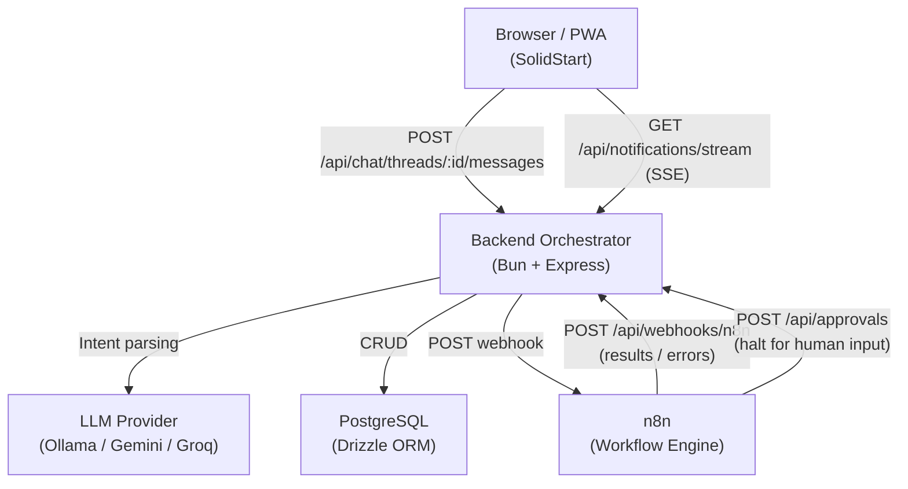
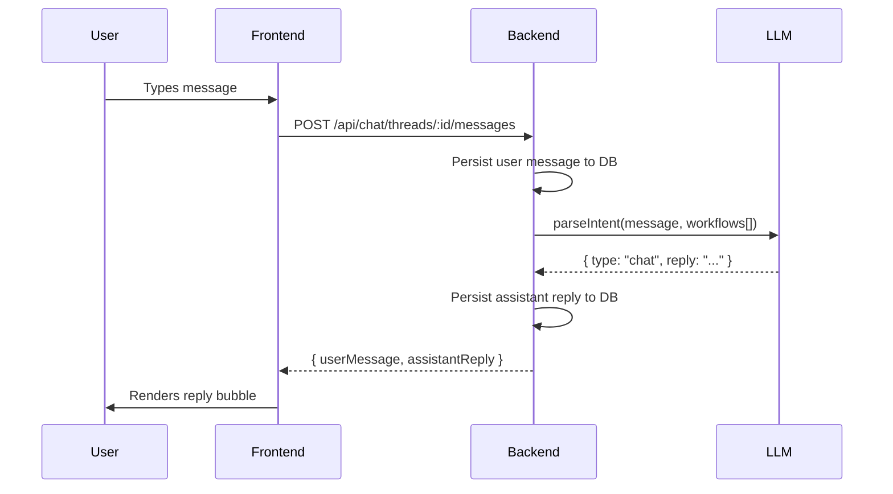
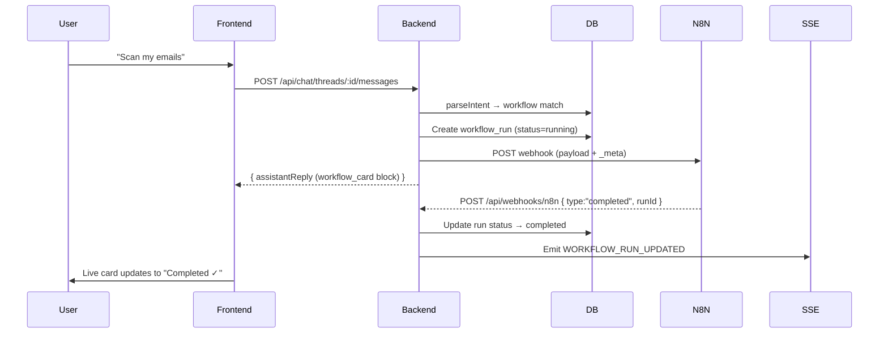
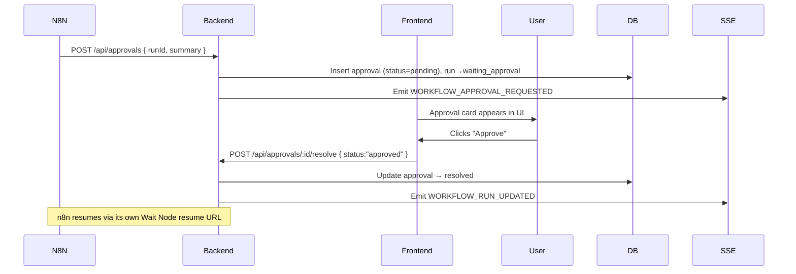

# AutoPilot — Architecture & Documentation

## System Overview

AutoPilot is a single-user, chat-first automation platform. Users interact through a conversational interface; the backend orchestrator classifies intent and either responds directly or triggers an n8n workflow via webhook.

---

## Component Map



---

## Core Request Flows

### 1. Normal Chat Message (No Workflow)



### 2. Workflow Trigger



### 3. Approval Flow



---

## Technology Decisions

| Concern | Choice | Reason |
|---|---|---|
| Frontend | SolidStart + SolidJS | Fine-grained reactivity; SSR + client hydration |
| Backend | Bun + Express | Fast runtime; familiar HTTP API layer |
| Database | PostgreSQL + Drizzle | Typed, migration-first ORM |
| Realtime | Server-Sent Events | Simpler than WebSockets; sufficient for 1-user app |
| Workflow Engine | n8n (external) | No-code builder; webhook-native |
| LLM | Pluggable (Ollama default) | Works offline; upgradeable to cloud |
| PWA | Service Worker (cache-first) | Installable + offline-safe |

---

## Directory Structure

```
chat-automation-platform/
├── apps/
│   ├── frontend/           # SolidStart PWA
│   │   ├── public/         # manifest.json, sw.js, icons/
│   │   └── src/
│   │       ├── components/ # UI components (layout, chat, ui)
│   │       ├── routes/     # File-based pages
│   │       └── app.tsx     # Root shell with ErrorBoundary + meta
│   └── backend/            # Bun + Express orchestrator
│       ├── src/
│       │   ├── db/         # Schema, migrations, seed
│       │   ├── middleware/  # trace, error, validate, webhook auth
│       │   ├── providers/llm/ # ILLMProvider, Ollama, Gemini
│       │   ├── repositories/  # Drizzle queries per domain
│       │   ├── routes/        # Express routers
│       │   ├── schemas/       # Zod validation schemas
│       │   └── services/      # Business logic layer
│       └── docs/           # n8n-contract.md, model-policy.md
└── packages/
    └── shared/             # Domain types shared between apps
```
