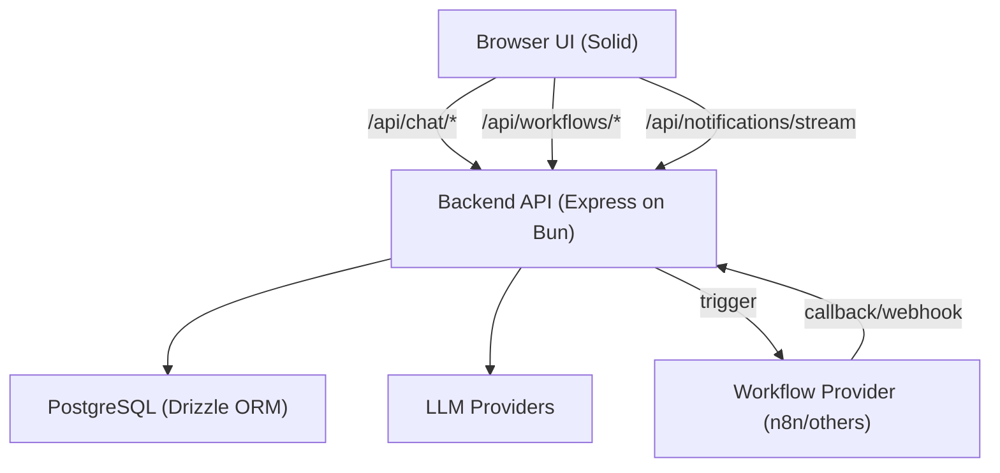

# AutoPilot Architecture (Current)

## System Overview

AutoPilot is a chat-first automation platform with:

- backend orchestration for chat + workflow routing
- workflow execution via provider adapters (n8n/make/zapier/custom/sim)
- callback-driven workflow completion updates
- approval-gated execution paths
- frontend chat UI that renders structured assistant blocks

## Runtime Model

- **Primary runtime**: `AgentService` (Mastra-based agent runtime)
- **Fallback runtime**: `OrchestratorService` (deterministic orchestration path)
- Chat routes call agent runtime first; if it fails, backend falls back to orchestrator.

## High-Level Component Map



## Backend Request Paths

### Chat (non-streaming)

1. Save user message + attachment links
2. Run `AgentService.handleIncomingMessage(...)`
3. On failure, fallback to `OrchestratorService.handleIncomingMessage(...)`
4. Persist assistant message blocks

### Chat (streaming SSE)

1. Open SSE stream
2. Persist user message
3. Emit `thinking` + block/chunk events
4. Attempt `AgentService.handleStreamingMessage(...)`
5. On failure, fallback to `OrchestratorService.handleStreamingMessage(...)`
6. Emit `complete` + close stream

### Workflow execution

1. Resolve workflow config and permissions
2. Create run record
3. Dispatch provider request
4. Receive callback (`/api/webhooks/n8n` or `/api/webhooks/callback`)
5. Update run + notify thread or notification inbox

### Approval flow

1. Workflow posts approval request to `/api/approvals`
2. Approval stored with `pending` state
3. User resolves via `/api/approvals/:id/resolve`
4. Workflow continues on provider side

## Security Architecture

Global middleware stack (from `apps/backend/src/index.ts`):

- `cors`
- JSON body limit
- security headers middleware
- auth middleware
- CSRF middleware
- rate-limit middleware
- trace middleware

Route-level protections:

- Auth-required mounts: `/api/chat`, `/api/workflows`, `/api/workflow-runs`, `/api/notifications`, `/api/settings`
- Webhook secret required: `/api/webhooks/*`
- Approvals create endpoint allows auth user or webhook secret

## Runtime Config Architecture

- Config source: `${AUTOPILOT_HOME}/config.json` (or `~/.autopilot/config.json`)
- Parsed and validated via Zod in `runtime.config.ts`
- Merges file + env with strict runtime validation

## Frontend Architecture

- Solid app with route-based screens (`apps/frontend/src/routes/*`)
- Chat renderer (`components/chat/*`) renders block types such as:
  - `summary`
  - `detail_toggle`
  - `markdown` / `text`
  - `email_draft`
  - `question_mcq`
  - `source`
- SSE streaming integration for real-time assistant output

## Deployment Topology

Current production Docker setup:

- single backend process in container
- frontend built as static output and served by backend (`FRONTEND_STATIC_DIR`)
- backend exposed on port `3000`

## Directory Map (Operational)

```text
apps/
  backend/
    src/
      config/        runtime config
      db/            schema + migration tooling + integrity tools
      middleware/    auth/csrf/rate-limit/security/trace/error
      providers/     llm + workflow provider adapters
      repositories/  persistence
      routes/        API endpoints
      services/      orchestration + domain logic
    test/            config/middleware/services/e2e
  frontend/
    src/
      components/    chat + layout + settings + ui
      routes/        pages/views
packages/
  shared/
    src/             shared DTO/contracts
```
